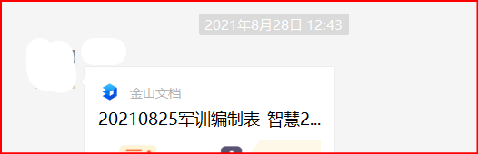
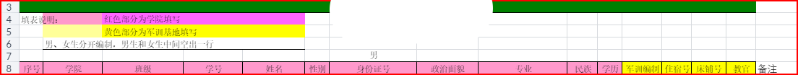

## 身份证号码会包含哪些信息

#### 日期：2021年09月14日

#### 前言

&emsp; 我国的公民身份证号码具有十八位。我以前虽然知道这相对于每个中国公民的编号，每个人都各不相同，，而且其中暗藏了自己的出生日期。但当我看了李永乐老师关于这方面的科普后才知道，这短短的十八位，居然将自己的 籍贯，出生日期，性别，办理身份证的地方，甚至还考虑了验证前面所有数据的校验码。

#### 解析身份证码

每个人的身份证十八位（以下用字母代替）大致如下：

| A18A17A16A15A14A13 | A12A11A10A9A8A7A6A5 | A4A3A2 | A1 |
| ------------------------------------------------------------ | ------------------------------------------------------------ | --------------------------------------- | ------------- |
| 籍贯                                                         | 出生日期                                                     | 顺序码                                  | 校验码        |

##### 籍贯：

在表示籍贯的数字里，**A18A17** 表示 **省份**，**A16A15** 表示 **市**，最后 **A14A13** 则表示 **区**。

##### 出生日期

&emsp; 这一段数字应该每一个人都特别熟悉，这也应该是大多数人对于身份证包含信息中的最了解的一部分了。我小时候还是以这一段数字为基础上才把我的身份证码给被了下来。

&emsp; 这里面 **A12A11A10A9** 代表 **出生年份**，**A8A7** 代表 **出生月份**，最后 **A6A5** 代表 **出生日子**。

##### 顺序码

&emsp; 每个地区，每一天里出生的人数是不固定的，为了防止身份证号码的重复，就需要这个顺序码了。但我估计这个顺序码应该不是指我们到达这个世界的时间顺序。因为**不同顺序段的号码是在不同派出所里**的。而且其中还包含了一个独特的规则：里面最后一位数（A2）**奇男偶女**。

##### 校验位

&emsp; 为了防止日常中大家把自己的身份证码输错，里面也就多了一位校验位：**A1**。计算公式如下：
$$\sum_{i=1}^{18}W_iA_i\equiv1\quad(mod\quad 11)$$
&emsp; 公式里 **Ai** 是上述的身份证码代表的数字

**Wi** 则是数字 **Ai** 的 权重因子（计算公式下文给出）

$$\equiv$$

表示 **同余**， 表示 所有身份证码与它的权重因子相乘之后加起来除以 11 结果为 1

&emsp; 这里面 **Wi** 的计算公式为：
$$W_i=2^{i-1}\quad mod\quad11$$
&emsp; 公式里 **mod** 表示求余数。

#### 感想

&emsp; 这么短短的一串数字码，就包含了我们如此多的信息。虽然到处都在宣传隐私保护，而且每个人也都认可着隐私保护重要性。但是又有多少人具备足够的隐私敏感性呢？就拿我们学校举例，一份在8月28日需要填写的一份在线表格。

&emsp; 在我写这篇博客的时候（9月14日），依旧可以正常打开并阅读其中全部信息。而其中包含的信息就有 身份证号码 与 姓名 与 学生号等等。而且这还是我们在自己本身就是计算机系的学生的情况之下。

&emsp; 如果这些信息泄露会造成什么后果呢？我只列举一个与我最贴切的例子。每年大学生的四级成绩查询可都是只用输入 身份证号码 与 姓名 的。

#### 参考：

【1】：[史上最靓身份证号即将诞生！李永乐老师揭秘身份证号码的秘密](https://b23.tv/cRkINJ)，[李永乐老师官方](https://space.bilibili.com/9458053)

