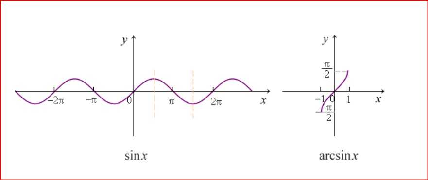
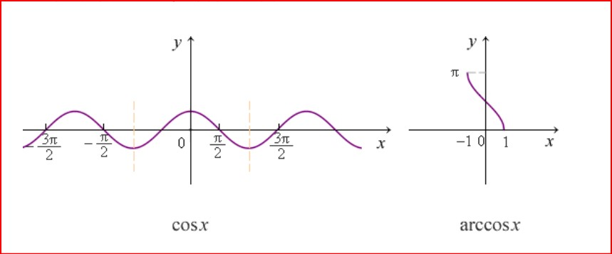
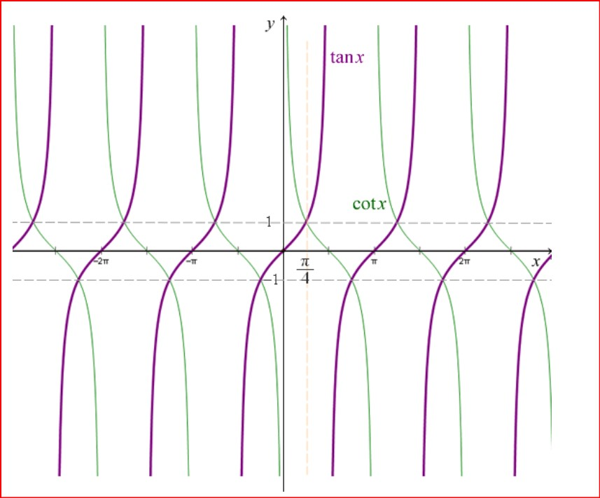
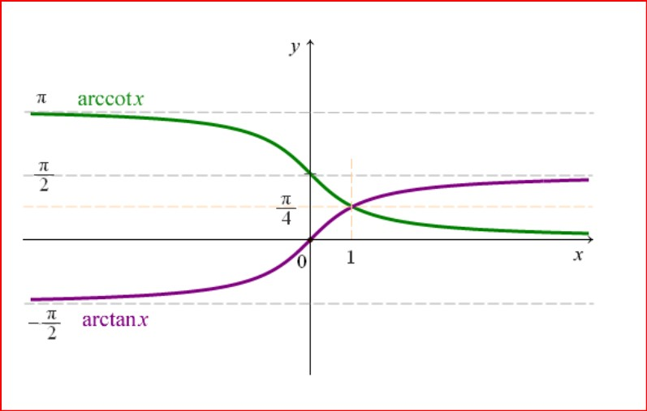
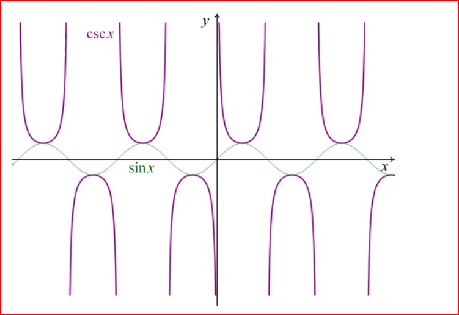
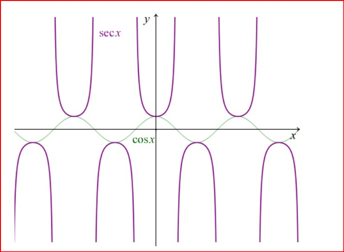

#### 三角函数乘积变换和差公式 

$sinAsinB=-\frac{cos(A+B)-cos(A-B)}{2}$ 

$cosAcosB=\frac{cos(A+B)+cos(A-B)}{2} $

$sinAcosB=\frac{sin(A+B)+sin(A-B)}{2} $

$cosAsinB=\frac{sin(A+B)-sin(A-B)}{2}$ 

#### 三角函数和差变换乘积公式 

$sinA+sinB=2sin(\frac{(A+B)}{2})cos(\frac{A-B}{2}) $

$sinA-sinB=2cos(\frac{A+B}{2})sin(\frac{A-B}{2}) $

$cosA+cosB=2cos(\frac{A+B}{2})cos(\frac{A-B}{2}) $

$cosA-cosB=-2sin(\frac{A+B}{2})sin(\frac{A-B}{2}) $

$tanA+tanB=\frac{sin(A+B)}{cosAcosB}=tan(A+B)(1-tanAtanB) $

$tanA-tanB=\frac{sin(A-B)}{cosAcosB}=tan(A-B)(1+tanAtanB)$

#### 三角函数两角和与差公式 

$sin(A+B)=sinAcosB+cosAsinB $

$sin(A-B)=sinAcosB-cossinB $

$cos(A+B)=cosAcosB-sinAsinB $

$cos(A-B)=cosAcosB+sinAsinB $

$tan(A+B)=\frac{tanA+tanB}{1-tanAtanB} $

$tan(A-B)=\frac{tanA-tanB}{1+tanAtanB}$

#### 三角函数半角公式 

$sin(A/2)=±\sqrt{\frac{1-cosA}{2}} $

$cos(A/2)=±\sqrt{\frac{1+cosA}{2}} $

$tan(A/2)=±\sqrt{\frac{1-cosA}{1+cosA}} $

#### 三角函数倍角公式

$sin2A=2sinA*cosA $

$cos2A=cosA^2-sinA^2=1-2sinA^2=2cosA^2-1 $

$tan2A=\frac{2tanA}{1-tanA^2}$

$\cos^2A=\frac{1+\cos 2A}{2}$

$\sin^2A=\frac{1-\cos 2A}{2}$

$\tan^2A=\frac{1-\cos 2A}{1+\cos 2A}$

#### 三角函数倒数关系公式

$\sin A\csc A=1$

$\cos A\sec A=1$

$\tan A\cot A=1$

#### 三角函数商数关系公式

$\tan A=\frac{\sin A}{\cos A}$

$\cot A=\frac{\cos A}{\sin A}$

#### 三角函数平方关系公式

$\sin^2A+\cos^2A=1$

$1+\tan^2A=sec^2A$

$1+\cot^2A=\csc^2A$

#### 三角函数图形

**$\sin x$  and  $\arcsin x$**

**$\cos x$  and  $\arccos x$**

**$\tan x$ and  $\cot x$**

**$arccot x$ and $\arctan x $**

**$\csc x$**

**$\sec x$**

